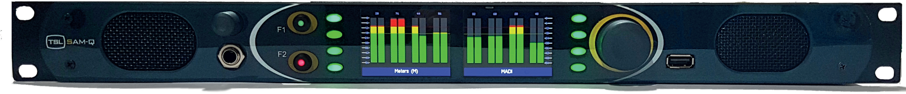

<h1 align="center">
  SAM-Q-NET Backend
  <br>
  
  <br>
</h1>

<p align="center" style="font-size: 1.2rem;">SAM-Q-NET is the worlds first dedicated network audio monitor, bringing the benefits of the SAM-Q platform to broadcast IP networks, with support for ST 2110-30, ST 2022-7, AES67 and NMOS. </p>

<hr />

***Prerequisite:***

Clone this repository:

```
git clone https://gitlab.tslproducts.com/kalyani.pawar/samqnetbackend.git
```

Install npm packages:

```
npm install
```

Start working:

```
node .
```

